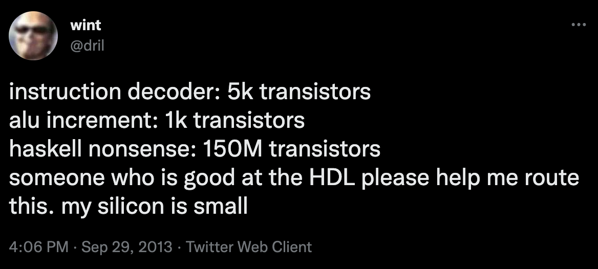

 

# clash silicon

a (very small) synthesized cpu written in [clash](https://clash-lang.org/).

# building

```sh
$ nix-shell --pure --run "make"
```

see `default.nix` for dependencies.

# testing

```sh
$ nix-shell --pure --run "make lint test"
```

## clash
clash-level tests are written in haskell using [quickcheck](https://hackage.haskell.org/package/QuickCheck).
- testing pure haskell functions abstracted away from e.g. clock cycles
- fuzzing

## HDL
HDL-level tests are written using [cocotb](https://www.cocotb.org/) and a small `src/tb.v` shim.
- verification of the compiled Clash
- clock-cycle dependencies
- GTKWave

to generate GTKWave output for a single cocotb test, here `test_regfile`,

```sh
$ TESTCASE="test_regfile" nix-shell --run "make -C test"
```

# special thanks

- [Matt Venn](https://mattvenn.net/)
- Connor Northway & Eddie Zhou (feedback and rubber ducking)



# resources

- [tinytapeout](https://tinytapeout.com/)
- [TT02 verilog template](https://github.com/TinyTapeout/tt02-verilog-demo)
